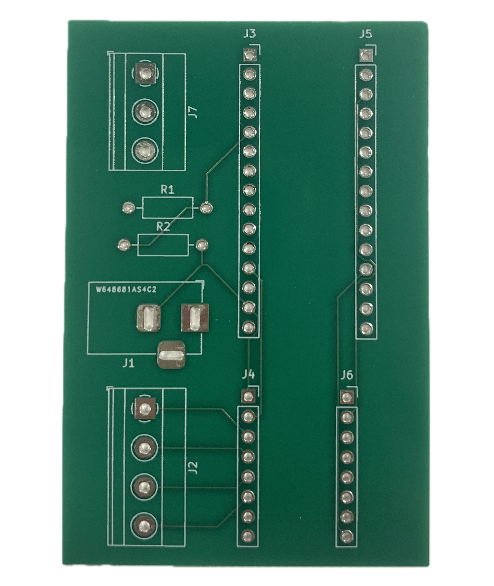
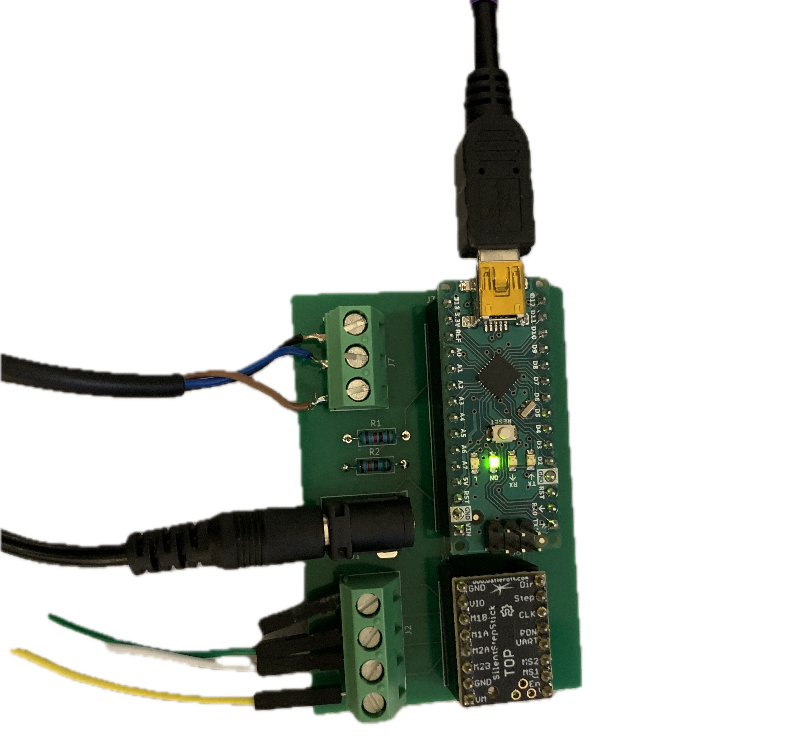
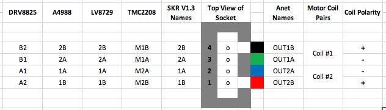

# TurretBot for automated acoustic experiments. 

Already have the hardware setup? Jump to the [Software section](#Software).


## Sourcing the parts

#### 🧾 Fabrication Files

All files required for manufacturing the PCB can be found here:  
👉 [PCB Manufacturing Files](./tmc%20pcb%20manufacturing%20files/feb2025_fab)


#### 🔩 Component List

| Part Name                                                | Quantity | Designation on Schematic         | Link                                                                 |
|----------------------------------------------------------|----------|----------------------------------|----------------------------------------------------------------------|
| Barrel Jack for power                                    | 1        | J1 (Barrel_Jack)                 | [digikey](https://www.digikey.com/en/products/detail/same-sky-formerly-cui-devices/PJ-002A/96962)           |
| PinSocket headers for Arduino Nano                       | 2        | J3, J5                            | [digikey](https://www.digikey.com/en/products/detail/sullins-connector-solutions/PPTC151LFBN-RC/810153)     |
| PinSocket headers for TMC 2208 driver chip               | 2        | J4, J6                            | [digikey](https://www.digikey.com/en/products/detail/w%C3%BCrth-elektronik/61300811821/17737805)            |
| Induction sensor terminal block                          | 1        | J7                                | [digikey](https://www.digikey.com/en/products/detail/phoenix-contact/1715734/260632)                        |
| Terminal Block for stepper motor                         | 1        | J2 (Screw_Terminal for motor)     | [digikey](https://www.digikey.com/en/products/detail/phoenix-contact/1715747/260633)                        |
|TMC 2208 motor driver chip                                 | 1        |  None                            | [digikey] (https://www.digikey.com/short/j84mhvfm)|
| Adafruit adjustable power supply                      | 1         | None                                | [digikey] (https://www.digikey.com/short/31r0mw15)  |
| Induction sensor                                      | 1         | None                                  | [amazon] (https://www.amazon.com/Taiss-NO%EF%BC%88Normally-LJ12A3-4-Z-inductive-Proximity/dp/B073XD44CW) |

## 🔧 Assembly Instructions

Follow the designators on this PCB to solder the parts above: ([also have schematic for reference](./images/pcb_v2_schematic.png))



Final assembled PCB:




For motor connector reference (What's color code M1B, M1A etc)


Follow this github tutorial to Solder UART bridge on tmc 2208 chip:
https://github.com/teemuatlut/TMC2208Stepper?tab=readme-ov-file


## Software


### 1. Clone the Repository
```bash
git clone https://github.com/LeoLin6/TurretBot.git
cd TurretBot
```

### 2. Install Arduino IDE

If you don't already have the Arduino IDE installed, download and install it from the official website:  
🔗 [https://www.arduino.cc/en/software](https://www.arduino.cc/en/software)

### 3. Flash the Arduino

1. **Open Arduino IDE**  
2. **Go to:**  
   `File` → `Open` → Navigate to `main/src/softwareserial_ver_tmc_uart`  
3. **Connect your Arduino** via USB to your PC.
4. **Select the correct board and port**:  
   - `Tools` → `Board` → Select the correct Arduino board (e.g., Arduino Uno)  
   - `Tools` → `Port` → Select the appropriate COM port (note it down, you'll need it for the next step)  
5. **Click Upload** (the right-arrow icon) to flash the firmware to the Arduino.

### 4. Run the Python Script for Calibration

1. Make sure you have Python installed (preferably Python 3.x).  
2. Navigate to the script directory:
```bash
cd curr_project
```
3. Run the script:
```bash
python serial_comm.py
```
4. Follow the terminal prompts for calibration and testing positional movement.

> 💡 Make sure the COM port in the script matches the one your Arduino is using.
